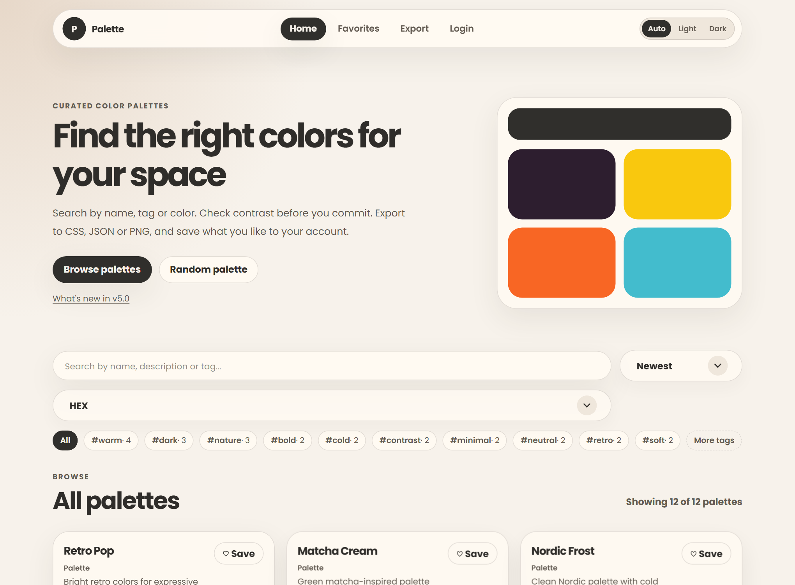
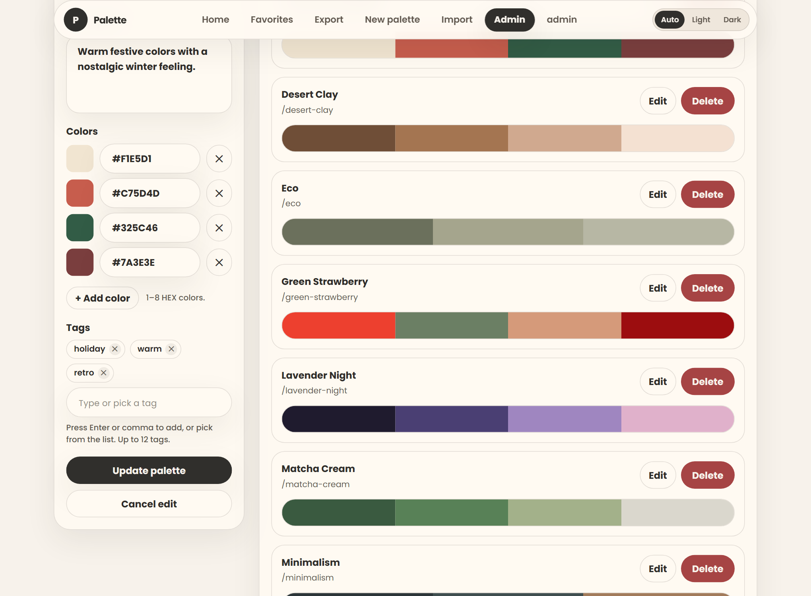
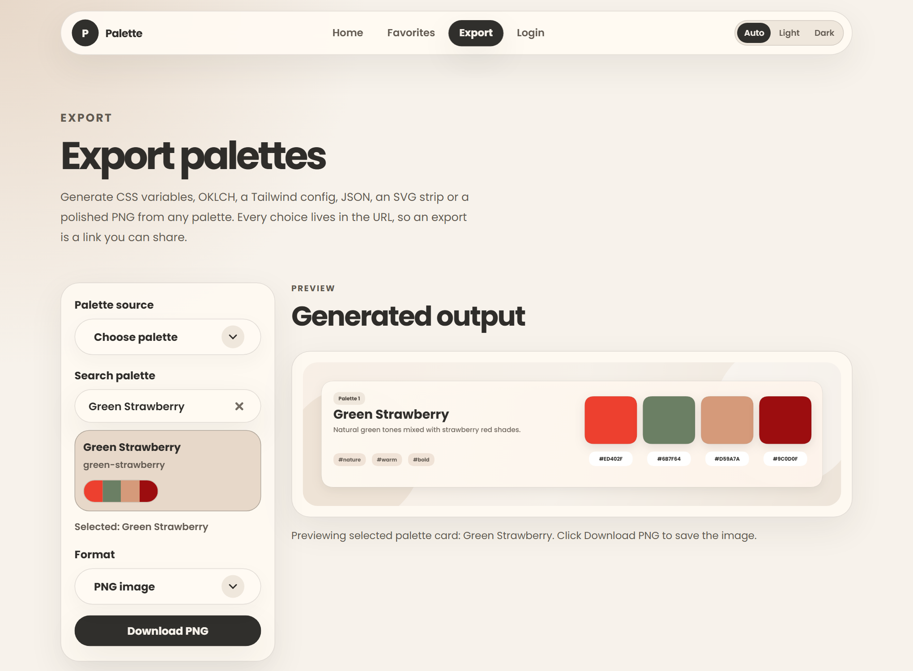
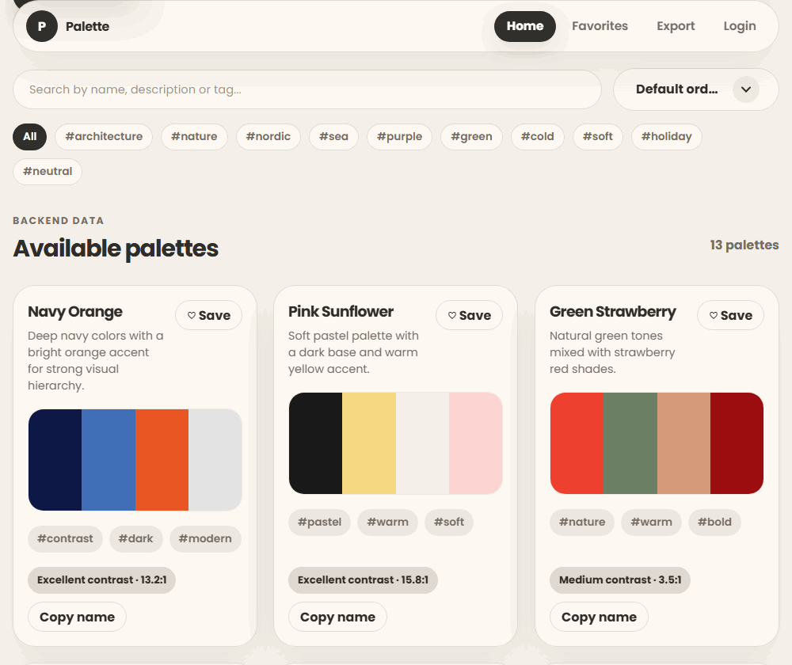
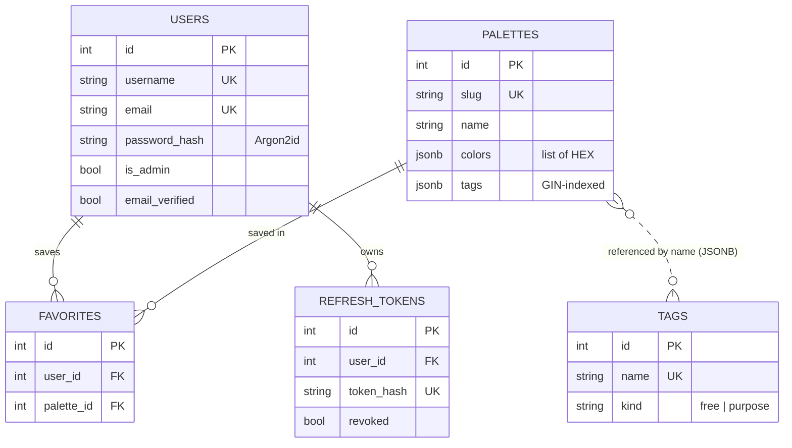
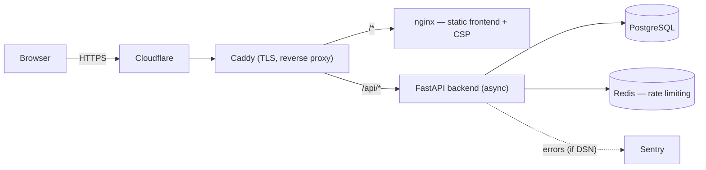

# Palette v4.8.1 — Full-Stack Color Palette App

[](https://palettes-app.com)
[](https://github.com/Ingwalde/Palette/actions/workflows/ci.yml)


Browse, search, save and export colour palettes. Palette is a solo portfolio project built to a
production bar: httpOnly-cookie auth with CSRF, an async FastAPI backend on PostgreSQL, Redis-backed
rate limiting, encrypted secrets, and continuous delivery to a live server.

```text
Frontend → Fetch API → FastAPI Backend → PostgreSQL Database
```

**Live demo: [palettes-app.com](https://palettes-app.com)** — deployed on an Oracle Cloud VM behind
Cloudflare + Caddy, auto-deployed on every green build to `main`. Full release history in
[`CHANGELOG.md`](CHANGELOG.md).

---

## Screenshots

| Home — browse & filter | Admin — colour-row editor | Export — PNG preview |
|---|---|---|
|  |  |  |



---

## Architecture

Full diagrams (ER, request path, auth flow) in [`docs/architecture.md`](docs/architecture.md).

### Data model



### Request path (production)



---

## Highlights

- **Cookie-based auth, done properly** — JWT access + rotating refresh tokens in httpOnly/Secure
  cookies, double-submit CSRF on mutations, Argon2id hashing, timing-safe comparison, server-side
  token revocation. Login by username **or** email.
- **Async request path** — FastAPI with async SQLAlchemy 2.0 (asyncpg) on PostgreSQL 16; `colors`
  and `tags` stored as JSONB with a GIN index for fast tag filtering.
- **Hardened by default** — Redis-backed rate limiting on **every** mutating endpoint, strict
  Content-Security-Policy and security headers, a CORS allowlist (never `*`), RFC 7807 errors, and a
  versioned, paginated `/api/v1`.
- **Secrets encrypted in git** — SOPS + age; the plaintext `.env` is never committed and secrets are
  decrypted only on the deploy host.
- **Continuous delivery** — a green CI run on `main` auto-deploys to the live VM (SSH pull + rebuild
  + readiness gate), with an isolated staging stack via a Compose override.
- **Operable in production** — liveness/readiness probes, optional Sentry error tracking, and a
  scripted database backup with retention.
- **Tested and linted** — an async pytest suite with ruff, mypy and an 80% coverage gate, all
  enforced in CI.

---

## Built with

| Layer | Stack |
|---|---|
| **Backend** | FastAPI · async SQLAlchemy 2.0 (asyncpg) · Pydantic v2 · Alembic · Argon2 · slowapi |
| **Data** | PostgreSQL 16 (JSONB + GIN) · Redis |
| **Frontend** | Vanilla JS (ES modules) · HTML · CSS — no build step |
| **Infra** | Docker Compose · Caddy · Cloudflare · Oracle Cloud VM · SOPS + age |
| **Quality / CI** | GitHub Actions · ruff · mypy · pytest · Sentry |

---

## Features

### Auth & security

- JWT access + rotating refresh tokens in **httpOnly cookies** with server-side revocation, plus
  **double-submit CSRF** on mutating requests.
- Argon2id password hashing (legacy PBKDF2 upgraded on next login); timing-safe comparison.
- Login by username or email; email verification with a verify-link auto-login; password reset by
  email; self-service account deletion.
- Redis-backed rate limiting (shared across instances) on auth and every mutating endpoint.
- Strict CSP and security headers (X-Frame-Options, X-Content-Type-Options, Referrer-Policy,
  Permissions-Policy); explicit CORS allowlist; mandatory `SECRET_KEY` (fail-fast at startup).
- Secrets encrypted in git via SOPS + age.

### API & data

- Versioned API under `/api/v1`; public palette API, auth API, favorites API, tag catalog.
- Paginated palette list (`{ items, total, limit, offset }` + `X-Total-Count`), with SQL-side
  search, tag filtering and sorting; `colors`/`tags` as JSONB with a GIN index on `tags`.
- RFC 7807 `application/problem+json` error responses; Pydantic v2 validation.
- Alembic migrations (safe adoption of a pre-Alembic database on startup); typed configuration via
  `pydantic-settings`; automatic seeding and first-admin creation from `.env`.
- Swagger UI at `/api/docs` (off by default; enable with `ENABLE_API_DOCS=true`).

### Ops & delivery

- Liveness (`/health`) and readiness (`/health/ready`, checks database + Redis) probes; the Compose
  healthcheck uses readiness.
- Continuous delivery: production auto-deploys after CI passes on `main`; isolated staging stack via
  a Compose override (see [`docs/deploy.md`](docs/deploy.md)).
- Optional Sentry error tracking (off unless `SENTRY_DSN` is set); scripted database backups with
  retention (see [`docs/ops.md`](docs/ops.md)).
- Structured logging (`LOG_LEVEL`); automated tests with ruff, mypy and an 80% coverage gate in CI.

### Frontend

- Single-page navigation (fetch + content swap, no full reload) with a page cross-fade and a sliding
  tab indicator.
- Search by name, description, slug and tags; tag filtering and sorting; staggered card animations.
- Save/remove favorites tied to the logged-in user; account page with password change; admin-only
  navigation hidden from guests.
- Admin palette manager with a dynamic HEX-row colour editor and chip-based tag editing.
- Export a selected palette as CSS, SCSS, JSON or a standalone PNG palette card, with live preview.
- Accessible touches: skip-to-content link, visible focus states, ARIA-labelled controls; works over
  the LAN via a dynamic API base.

---

## Quick start with Docker

Palette runs on PostgreSQL via Docker Compose — database, backend and static frontend together. This
is the only supported way to run it (no SQLite / non-Docker mode).

```bash
docker compose up --build
```

- Backend: `http://localhost:8000` (Swagger at `/api/docs` when `ENABLE_API_DOCS=true`)
- Frontend: `http://localhost:5500`
- Database: PostgreSQL in the `db` service, data persisted in the `pgdata` volume.

`backend/.env` must exist (copy `backend/.env.example` and set a real `SECRET_KEY`). Compose sets
`DATABASE_URL` automatically. Stop with `docker compose down` (add `-v` to drop the database volume).

### Tests

```bash
docker compose --profile test run --rm tests
```

Runs the suite against a disposable PostgreSQL in its own Compose profile.

---

## Development

Backend quality is enforced with ruff (lint + format), mypy and a pytest coverage gate — the same
checks run in CI.

```bash
pip install -r backend/requirements-dev.txt
pre-commit install

ruff check backend/app backend/tests     # lint
ruff format backend/app backend/tests    # format
mypy backend/app                          # type-check
```

Schema changes use Alembic (`backend/alembic/`); the app runs migrations on startup and adopts an
existing pre-Alembic database safely. Add a migration with:

```bash
docker compose run --rm backend alembic revision -m "describe change"
```

---

## Project structure

```text
Palette/
├── frontend/                 # HTML pages, css/, js/ (api, pages, components, utils) — no build
├── backend/
│   ├── app/                  # main, config, database, models, schemas, security, routers/, crud
│   ├── alembic/              # migrations
│   ├── tests/                # async pytest suite
│   └── requirements*.txt
├── docs/                     # architecture, deploy, ops, secrets, api, auth, database, setup…
├── scripts/                  # backup-db.sh
├── .github/workflows/        # ci.yml, deploy.yml
├── docker-compose.yml        # + docker-compose.staging.yml
├── secrets.enc.env           # SOPS-encrypted secrets (safe to commit)
├── CHANGELOG.md · ROADMAP.md
```

---

## Environment variables

Copy `backend/.env.example` to `backend/.env` and fill it in:

```env
SECRET_KEY=change-this-secret-key-before-sharing
ACCESS_TOKEN_EXPIRE_MINUTES=1440
LOG_LEVEL=INFO
ENABLE_API_DOCS=false
CORS_ORIGINS=http://localhost:5500,http://127.0.0.1:5500
# DATABASE_URL is mandatory (PostgreSQL). Docker Compose sets it from the values below.
POSTGRES_USER=palette
POSTGRES_PASSWORD=palette
POSTGRES_DB=palette
DEFAULT_ADMIN_USERNAME=admin
DEFAULT_ADMIN_EMAIL=admin@palette.local
DEFAULT_ADMIN_PASSWORD=change-this-admin-password
# Email verification (Resend). Without RESEND_API_KEY the app logs the link instead.
RESEND_API_KEY=
EMAIL_FROM=Palette <noreply@palettes-app.com>
PUBLIC_BASE_URL=http://localhost:5500
```

`SECRET_KEY` is **mandatory** — the backend refuses to start if it is missing or left as a
placeholder. Generate one with:

```bash
python -c "import secrets; print(secrets.token_urlsafe(48))"
```

`CORS_ORIGINS` is a comma-separated allowlist of browser origins (never `*`). Do not commit
`backend/.env` — it is git-ignored; production secrets live encrypted in `secrets.enc.env`
(see [`docs/secrets.md`](docs/secrets.md)).

---

## API overview

```text
GET    /api/v1/palettes            # paginated, ?search= ?tag= ?sort= ?limit= ?offset=
GET    /api/v1/tags
POST   /api/v1/auth/register
POST   /api/v1/auth/login
POST   /api/v1/auth/refresh
POST   /api/v1/auth/logout
GET    /api/v1/auth/me
DELETE /api/v1/auth/me
GET    /api/v1/auth/verify?token=...
POST   /api/v1/auth/forgot-password
POST   /api/v1/auth/reset-password
PUT    /api/v1/auth/password
GET    /api/v1/favorites
POST   /api/v1/favorites/{slug}
DELETE /api/v1/favorites/{slug}
```

Admin palette/tag mutations require an authenticated admin (`is_admin = true`). `GET /api/v1/palettes`
is paginated (`{ items, total, limit, offset }` + `X-Total-Count`). Errors are returned as
`application/problem+json` (RFC 7807).

---

## Version

```text
v4.8.1
```

## License

Licensed under the [PolyForm Noncommercial License 1.0.0](LICENSE) — you may use, modify and share
this project for **noncommercial** purposes only. Commercial use is not permitted. This is a
source-available license, not an OSI open-source license.

Copyright 2026 Ingwald.
