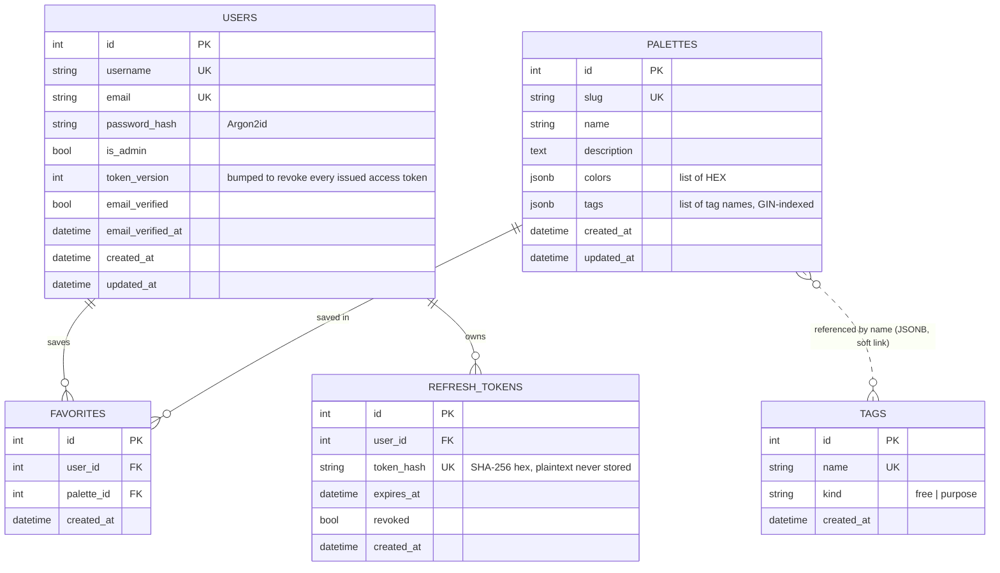
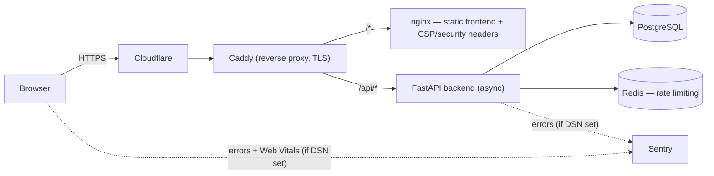
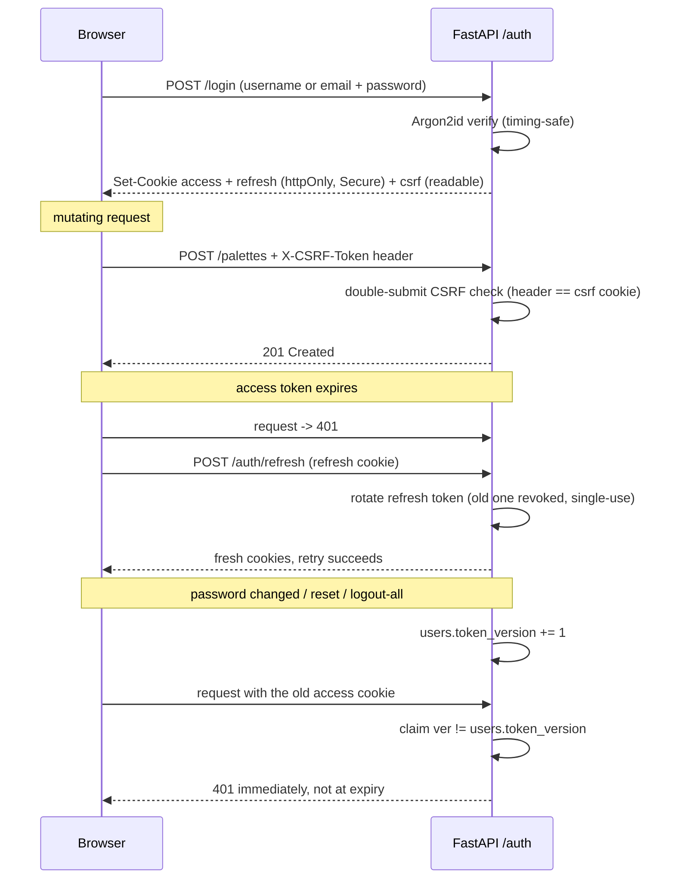

# Architecture

Diagrams render natively on GitHub. Source of truth for the data model is
[`backend/app/models.py`](../backend/app/models.py); for the request path,
[`docker-compose.yml`](../docker-compose.yml) and the production Caddy config.

## Data model (ER)

Five tables. Favorites is the join between users and palettes; refresh tokens are per-user and
single-use (rotated on refresh). Tags are a **catalog** — palettes still store their tags inline
as a JSONB string array (GIN-indexed for fast containment filtering), so the link between
`palettes.tags` and `tags.name` is by value, not a foreign key.

## Request path (production)

Cloudflare terminates the edge; Caddy on the VM serves TLS and splits static frontend from the
API. Redis backs cross-process rate limiting; Sentry receives errors from both the backend and
the browser frontend when a DSN is set.

## Authentication flow (httpOnly cookies + CSRF)

Tokens live in httpOnly cookies so XSS cannot read them. Mutations carry the readable
`csrf_token` back in an `X-CSRF-Token` header (double-submit). Access expiry triggers a silent
refresh that rotates the single-use refresh token.

Access tokens are stateless JWTs, so they cannot be looked up and deleted. Instead they carry
the user's `token_version` as a claim, compared against the row on every request — bumping it
retires every token already issued, immediately. See [`auth.md`](auth.md).

